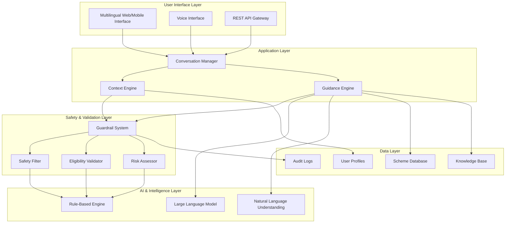

# Design Document: Info-Bharat Platform

## Overview

Info-Bharat is a context-aware AI-powered public decision guidance platform that combines the conversational capabilities of Large Language Models (LLMs) with rule-based safety guardrails to provide safe, accurate, and personalized guidance to Indian citizens. The system architecture prioritizes user safety, especially for vulnerable populations, while delivering intelligent recommendations for government schemes, services, and opportunities.

The platform employs a hybrid AI approach where LLMs handle natural language understanding and generation, while deterministic rule-based systems ensure safety, eligibility validation, and legal compliance. This design ensures both intelligent interaction and consistent safety guarantees.

## Architecture

The Info-Bharat platform follows a layered architecture with clear separation of concerns:



### Key Architectural Principles

1. **Safety First**: All AI-generated content passes through rule-based validation before reaching users
2. **Context Awareness**: User context drives all recommendations and safety measures
3. **Hybrid Intelligence**: LLMs provide conversational intelligence while rules ensure safety and accuracy
4. **Scalability**: Microservices architecture supports horizontal scaling
5. **Auditability**: All decisions and guardrail interventions are logged for review

## Components and Interfaces

### Conversation Manager
**Purpose**: Orchestrates user interactions and coordinates between all system components.

**Key Responsibilities**:
- Session management and conversation flow control
- Request routing to appropriate components
- Response aggregation and formatting
- Multi-turn conversation context maintenance

**Interfaces**:
- `processUserInput(userId: string, input: UserInput): Promise<Response>`
- `maintainSession(sessionId: string, context: ConversationContext): void`
- `routeRequest(request: UserRequest): Promise<ComponentResponse>`

### Context Engine
**Purpose**: Analyzes, maintains, and updates user context throughout interactions.

**Key Responsibilities**:
- User profiling and context extraction
- Context validation and completeness checking
- Dynamic context updates based on conversation
- Privacy-compliant context storage

**Interfaces**:
- `extractContext(userInput: UserInput): UserContext`
- `validateContext(context: UserContext): ValidationResult`
- `updateContext(userId: string, newContext: Partial<UserContext>): void`
- `getContext(userId: string): UserContext`

### Guidance Engine
**Purpose**: Generates personalized recommendations using AI while respecting safety constraints.

**Key Responsibilities**:
- LLM-powered response generation
- Personalization based on user context
- Integration with scheme database for accurate information
- Recommendation ranking and filtering

**Interfaces**:
- `generateGuidance(context: UserContext, query: string): Promise<GuidanceResponse>`
- `personalizeRecommendations(schemes: Scheme[], context: UserContext): Scheme[]`
- `formatResponse(guidance: RawGuidance, userPreferences: UserPreferences): FormattedResponse`

### Guardrail System
**Purpose**: Validates all system outputs for safety, appropriateness, and accuracy before delivery.

**Key Responsibilities**:
- Safety validation for vulnerable users
- Eligibility verification for recommended schemes
- Risk assessment for all guidance
- Legal compliance checking

**Interfaces**:
- `validateSafety(response: GuidanceResponse, userContext: UserContext): SafetyResult`
- `checkEligibility(userId: string, schemeId: string): EligibilityResult`
- `assessRisk(guidance: GuidanceResponse, userProfile: UserProfile): RiskAssessment`
- `enforceCompliance(response: GuidanceResponse): ComplianceResult`

### Safety Filter
**Purpose**: Specialized component for protecting vulnerable users, especially minors.

**Key Responsibilities**:
- Age-appropriate content filtering
- Vulnerability detection and protection
- Harmful content blocking
- Enhanced monitoring for at-risk users

**Interfaces**:
- `filterForAge(content: Content, userAge: number): FilteredContent`
- `detectVulnerability(userProfile: UserProfile): VulnerabilityAssessment`
- `blockHarmfulContent(content: Content): boolean`
- `applyEnhancedProtection(userId: string): ProtectionSettings`

## Data Models

### User Context Model
```typescript
interface UserContext {
  userId: string;
  demographics: {
    age: number;
    ageVerified: boolean;
    role: UserRole; // STUDENT | FARMER | INFORMAL_WORKER | UNEMPLOYED
    region: {
      state: string;
      district: string;
      ruralUrban: 'RURAL' | 'URBAN';
    };
    languages: string[];
    educationLevel: EducationLevel;
  };
  currentSituation: {
    employmentStatus: EmploymentStatus;
    incomeRange: IncomeRange;
    familySize: number;
    specialCircumstances: string[];
  };
  vulnerabilityFlags: {
    isMinor: boolean;
    isAtRisk: boolean;
    requiresEnhancedProtection: boolean;
    riskFactors: string[];
  };
  preferences: {
    language: string;
    communicationMode: 'TEXT' | 'VOICE' | 'BOTH';
    complexityLevel: 'SIMPLE' | 'DETAILED';
  };
  sessionData: {
    currentGoals: string[];
    conversationHistory: ConversationTurn[];
    lastInteraction: Date;
  };
}
```

### Scheme Model
```typescript
interface Scheme {
  schemeId: string;
  name: string;
  description: string;
  category: SchemeCategory;
  eligibilityCriteria: {
    ageRange: { min: number; max: number };
    incomeLimit: number;
    geographicScope: GeographicScope;
    educationRequirements: EducationLevel[];
    employmentStatus: EmploymentStatus[];
    specialConditions: Condition[];
  };
  benefits: {
    type: BenefitType;
    amount: number;
    duration: string;
    description: string;
  };
  applicationProcess: {
    steps: ApplicationStep[];
    requiredDocuments: Document[];
    timeline: string;
    applicationChannels: Channel[];
  };
  metadata: {
    authority: string;
    lastUpdated: Date;
    status: 'ACTIVE' | 'SUSPENDED' | 'DISCONTINUED';
    successRate: number;
  };
}
```

### Safety Rule Model
```typescript
interface SafetyRule {
  ruleId: string;
  name: string;
  description: string;
  conditions: {
    userAge?: { min?: number; max?: number };
    vulnerabilityFlags?: string[];
    contentType?: ContentType[];
    riskLevel?: RiskLevel;
  };
  actions: {
    block: boolean;
    modify: boolean;
    escalate: boolean;
    logLevel: LogLevel;
    alternativeResponse?: string;
  };
  priority: number;
  isActive: boolean;
}
```

### Guidance Response Model
```typescript
interface GuidanceResponse {
  responseId: string;
  userId: string;
  query: string;
  recommendations: {
    schemes: Scheme[];
    actions: ActionItem[];
    resources: Resource[];
  };
  explanation: {
    reasoning: string;
    eligibilityNotes: string;
    nextSteps: string[];
  };
  safetyMetadata: {
    riskLevel: RiskLevel;
    appliedFilters: string[];
    guardrailInterventions: GuardrailIntervention[];
  };
  responseMetadata: {
    confidence: number;
    sources: string[];
    generatedAt: Date;
    language: string;
  };
}
```

Now I need to use the prework tool to analyze the acceptance criteria before writing the Correctness Properties section.

<function_calls>
<invoke name="prework">
<parameter name="featureName">info-bharat

## Correctness Properties

*A property is a characteristic or behavior that should hold true across all valid executions of a system—essentially, a formal statement about what the system should do. Properties serve as the bridge between human-readable specifications and machine-verifiable correctness guarantees.*

Based on the prework analysis and property reflection to eliminate redundancy, the following properties capture the essential correctness guarantees for Info-Bharat:

### Property 1: Context Collection and Validation
*For any* new user interaction, the Context_Engine should collect all essential context fields (age, role, region, life situation), validate the information for completeness and consistency, and request missing information before providing guidance.
**Validates: Requirements 1.1, 1.2, 1.3**

### Property 2: Context Persistence and Updates
*For any* user context change, the system should update the User_Profile, adjust future recommendations accordingly, and maintain context across sessions while respecting privacy requirements.
**Validates: Requirements 1.4, 1.5**

### Property 3: Minor Protection and Age-Appropriate Content
*For any* user identified as a minor, the Safety_Filter should restrict all guidance to age-appropriate content and services, preventing any recommendations that could lead to harm or exploitation.
**Validates: Requirements 2.1, 2.5**

### Property 4: Risk Assessment and Safe Alternatives
*For any* potentially risky or harmful guidance request, the Risk_Assessor should evaluate and block unsafe recommendations, providing safe alternative options instead.
**Validates: Requirements 2.2, 2.3**

### Property 5: Vulnerable User Protection
*For any* user detected as vulnerable, the system should apply enhanced safety protocols, monitoring, and protection measures appropriate to their risk level.
**Validates: Requirements 2.4**

### Property 6: Eligibility Validation and Explanation
*For any* government scheme inquiry, the Eligibility_Validator should check the user's profile against scheme requirements, explain ineligibility reasons when criteria are not met, and suggest alternative options.
**Validates: Requirements 3.1, 3.2**

### Property 7: Legal Compliance and Information Validation
*For any* recommendation or guidance, the system should ensure compliance with applicable laws and regulations, and validate user-provided information against official eligibility criteria.
**Validates: Requirements 3.3, 3.4**

### Property 8: Eligibility Change Notifications
*For any* change in user eligibility status, the system should notify users of newly available or no longer available opportunities.
**Validates: Requirements 3.5**

### Property 9: Scheme Database Completeness and Currency
*For any* government scheme in the database, it should contain current information including eligibility criteria, application processes, required documents, and deadlines, with updates reflected within 24 hours of authority changes.
**Validates: Requirements 4.1, 4.2, 4.3**

### Property 10: Comprehensive Search and Guidance
*For any* user search for opportunities, the system should return all relevant schemes based on context and eligibility, providing step-by-step application guidance for each recommendation.
**Validates: Requirements 4.4, 4.5**

### Property 11: Multilingual and Accessibility Support
*For any* supported language selection, the system should provide all interactions in that language, support voice recognition and synthesis, and adapt interfaces for low-literacy users and low-bandwidth conditions.
**Validates: Requirements 5.1, 5.2, 5.3, 5.4, 5.5**

### Property 12: Hybrid AI Architecture Validation
*For any* AI-generated guidance, the system should use LLMs for conversation and recommendations while ensuring all output passes through rule-based validation before delivery.
**Validates: Requirements 6.1, 6.2**

### Property 13: AI Safety Override and Logging
*For any* conflict between AI recommendations and safety rules, the Guardrail_System should override the AI with safe alternatives, log all interventions, and default to conservative responses when validation fails.
**Validates: Requirements 6.3, 6.4, 6.5**

### Property 14: Role-Specific Personalization
*For any* user role (student, farmer, informal worker), the system should provide role-appropriate guidance content, adapt style and complexity based on education level, and provide intervention resources for at-risk users.
**Validates: Requirements 7.1, 7.2, 7.3, 7.4, 7.5**

### Property 15: Application Success Optimization
*For any* application guidance, the system should include all required documents with formats, provide proactive warnings for common errors, include timeline expectations, and suggest optimal application timing.
**Validates: Requirements 8.1, 8.2, 8.3, 8.4, 8.5**

### Property 16: Privacy Protection and Data Minimization
*For any* data collection and storage, the system should collect only minimum necessary information, encrypt all personal data, allow user data deletion, obtain explicit consent for external sharing, and comply with Indian data protection laws.
**Validates: Requirements 9.1, 9.2, 9.3, 9.4, 9.5**

### Property 17: Continuous Learning and System Improvement
*For any* user interaction and outcome, the system should track satisfaction metrics, record success patterns, analyze failures for algorithm adjustment, regularly update the knowledge base, and alert administrators when performance declines.
**Validates: Requirements 10.1, 10.2, 10.3, 10.4, 10.5**

## Error Handling

The Info-Bharat platform implements comprehensive error handling across all layers:

### User Input Errors
- **Invalid Context Data**: System validates all user-provided context and requests corrections for invalid or inconsistent information
- **Incomplete Profiles**: System guides users through completing required profile information before providing guidance
- **Language Barriers**: System detects language mismatches and offers language switching options

### AI and Processing Errors
- **LLM Failures**: System falls back to template-based responses when LLM services are unavailable
- **Guardrail Validation Failures**: System defaults to conservative, safe responses when rule validation encounters errors
- **Context Processing Errors**: System maintains conversation state and requests clarification when context cannot be processed

### Data and External Service Errors
- **Scheme Database Unavailability**: System provides cached information with appropriate disclaimers about currency
- **External API Failures**: System gracefully degrades functionality and informs users of temporary limitations
- **Authentication/Authorization Errors**: System provides clear guidance on resolving access issues

### Safety and Security Errors
- **Potential Harm Detection**: System immediately blocks potentially harmful content and provides safe alternatives
- **Privacy Violations**: System prevents data exposure and logs security incidents for review
- **Unauthorized Access**: System implements proper authentication and logs security events

## Testing Strategy

The Info-Bharat platform requires a comprehensive testing approach combining unit tests for specific scenarios with property-based tests for universal correctness guarantees.

### Property-Based Testing
Property-based testing will be implemented using **Hypothesis** (for Python components) and **fast-check** (for TypeScript/JavaScript components). Each correctness property will be implemented as a property-based test with minimum 100 iterations to ensure comprehensive input coverage.

**Property Test Configuration**:
- Minimum 100 iterations per property test
- Custom generators for Indian context data (states, languages, user roles)
- Specialized generators for government scheme data
- Safety-focused generators for vulnerable user scenarios

**Property Test Tags**:
Each property test will be tagged with: **Feature: info-bharat, Property {number}: {property_text}**

### Unit Testing
Unit tests will focus on:
- **Specific Examples**: Concrete scenarios demonstrating correct behavior
- **Edge Cases**: Boundary conditions and unusual input combinations
- **Integration Points**: Component interactions and data flow validation
- **Error Conditions**: Specific error scenarios and recovery mechanisms

**Key Unit Test Areas**:
- Context validation with specific invalid inputs
- Safety filter responses to known harmful content
- Eligibility validation with edge case user profiles
- Multilingual interface with specific language combinations
- Guardrail system responses to specific AI-safety conflicts

### Integration Testing
- **End-to-End User Journeys**: Complete user interactions from context collection to guidance delivery
- **Component Integration**: Verification of proper data flow between system components
- **External Service Integration**: Testing with mock government scheme APIs and databases
- **Safety Pipeline Integration**: Validation of complete safety validation workflows

### Performance and Load Testing
- **Response Time Validation**: Ensuring guidance delivery within acceptable time limits
- **Concurrent User Handling**: Testing system behavior under multiple simultaneous users
- **Low-Bandwidth Simulation**: Validating functionality under constrained network conditions
- **Mobile Device Testing**: Performance validation on basic mobile devices

### Security Testing
- **Privacy Protection Validation**: Ensuring user data protection across all scenarios
- **Input Sanitization**: Testing against malicious input attempts
- **Authentication and Authorization**: Validating access controls and user permissions
- **Data Encryption Verification**: Ensuring proper encryption of stored user data

The testing strategy ensures both functional correctness through property-based testing and practical reliability through comprehensive unit and integration testing, with special emphasis on safety and security validation for vulnerable user protection.