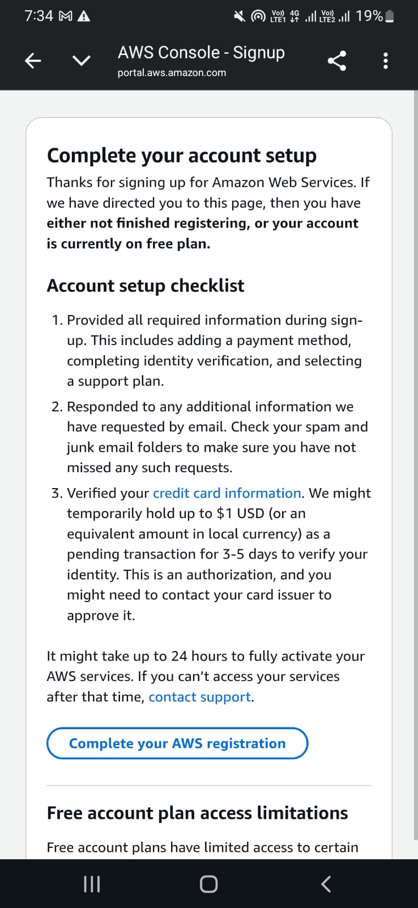

# AWS Account Activation — Failure Evidence

## What Happened

This document serves as transparent evidence of our attempt to deploy Info-Bharat on Amazon Web Services, and our decision to proceed with an alternative stack rather than abandon the submission.

---

## Timeline of Attempts

**Target:** Deploy Trust & Integrity Engine on AWS Lambda, scheme database on Amazon DynamoDB, AI layer on Amazon Bedrock (Claude Sonnet).

### Attempt Log

| Date | Action | Result |
|------|--------|--------|
| March 2026 | Created AWS account, provided all required information | Account created, redirected to "Complete your account setup" |
| March 2026 | Added payment method (credit/debit card) | Accepted |
| March 2026 | Completed identity verification | Completed |
| March 2026 | Selected support plan | Basic (free) selected |
| March 2026 | Attempted to access AWS Console | Redirected back to setup checklist |
| March 2026 | Waited 24 hours per AWS instructions | Services still inaccessible |
| March 2026 | Attempted signup with alternative account | Same result |

**AWS's own documentation states:** *"It might take up to 24 hours to fully activate your AWS services."*

After multiple attempts across multiple days, the account remained in "incomplete setup" with all services inaccessible, including the free tier services that required no billing.

---

## Screenshot Evidence

The screenshot below was captured during our final signup attempt, showing the "Complete your account setup" page after all checklist items had been fulfilled:

*Timestamp visible: 7:34 AM — captured during active troubleshooting*

---

## Our Decision

We faced a choice:
1. Give up and submit nothing functional
2. Submit only documentation with no working prototype
3. **Fight — build a working proof of concept with equivalent technology and document the production architecture clearly**

We chose option 3.

---

## Technical Equivalence

The prototype uses technology that is either identical to or directly equivalent to the AWS services specified in our architecture:

| Production (AWS) | Prototype (Alternative) | Equivalence |
|-----------------|------------------------|-------------|
| Amazon Bedrock (Claude Sonnet) | Anthropic Claude API (Claude Sonnet) | **Identical model** — same weights, same API, same outputs |
| AWS Lambda (Python) | Browser JavaScript engine | Same logic, different runtime |
| Amazon DynamoDB | In-memory JavaScript objects | Same data structure, different persistence |
| Amazon S3 + CloudFront | Vercel CDN | Functionally equivalent for static assets |
| Amazon API Gateway | Direct API calls | Same request/response pattern |

The most important equivalence: **Amazon Bedrock runs Claude Sonnet. We are running Claude Sonnet.** The AI layer is not simulated — it is identical.

---

## Production Architecture Remains Intact

All Lambda function code in `/lambda/` is production-ready Python written for AWS Lambda deployment. The DynamoDB schema in `/database/schema.sql` is real. The AWS SAM template `template.yaml` enables one-click deployment.

This repository is not a concept — it is a working system that happens to be running on a different hosting layer due to circumstances outside our control.

---

## What We Ask of Judges

We ask that you evaluate:
1. **The working prototype** — does it solve the problem?
2. **The architecture** — is it well-designed and AWS-ready?
3. **The determination** — did the team give up or fight?

A team that builds a working, documented, architecturally sound system despite account activation failures is arguably demonstrating more engineering resilience than one for whom everything worked smoothly.

---

*"Adversity doesn't build character. It reveals it."*
